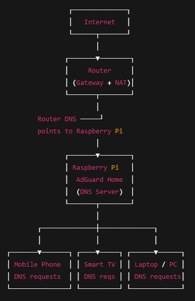

# Household Pi AdBlock (AdGuard Home)

A Raspberry Pi–based, network-wide ad blocking solution using **AdGuard Home**.
Designed for home networks to block ads, trackers, and malicious domains across
all devices — including mobile apps and smart TVs — without installing client software.

---

## Features
- Network-wide ad and tracker blocking
- Works with mobile apps and smart TVs
- Low-cost Raspberry Pi deployment
- DNS-level protection (no client apps required)
- Optional remote management (Tailscale-ready)

---

## Hardware Requirements
- Raspberry Pi Zero 2 W or Raspberry Pi 4
- MicroSD card (16GB+)
- Ethernet or Wi-Fi connection

---

## Operating System
- Raspberry Pi OS installed using **Raspberry Pi Imager**
- All remaining setup is performed via **command-line automation**

---

## Installation (Native)
```bash
git clone https://github.com/yourusername/household-pi-adblock.git
cd household-pi-adblock
chmod +x scripts/install_adguard.sh
sudo ./scripts/install_adguard.sh
```
After installation, access the AdGuard Home dashboard at:
http://"raspberry-pi-ip":3000

## Initial AdGuard Home Setup

After installation, AdGuard Home requires a one-time web-based setup.

Key steps include:
- Creating an admin user
- Selecting DNS listening interfaces
- Choosing upstream DNS providers
- Applying blocklists and security filters

Once configured, set your router’s DNS server to point to the Raspberry Pi
to enable network-wide filtering.


## Network Architecture

The diagram below shows how DNS traffic is routed through AdGuard Home
to provide network-wide ad and tracker blocking.




## Uninstall

To completely remove AdGuard Home from the system:

```bash
chmod +x scripts/uninstall_adguard.sh
sudo ./scripts/uninstall_adguard.sh
```

Note: If this device was configured as your router DNS,
you must manually update your router settings.
